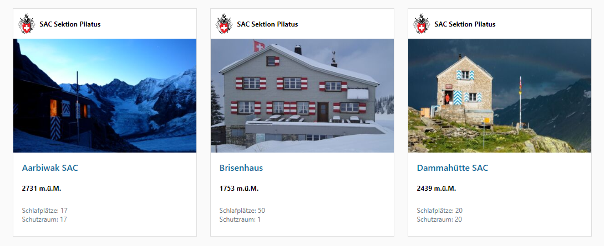

<div>


</div>

# SAC Cabin Bundle/SAC Hütten tool

Dieses Bundle für das Contao CMS enthält die Back- und Frontend Erweiterungen, um SAC Hütten auf der Sektionswebseite zu administrieren und zu veröffentlichen.



## Konfiguration
```yaml
# config/config.yml: override default swisstopo marker link in your config/config.yml
markocupic_sac_cabins:
  # The coord "%s" placeholders have to be escaped by an additional percent sign: %s => &&s
  geo_link: '//map.geo.admin.ch/embed.html?lang=de&topic=ech&bgLayer=ch.swisstopo.pixelkarte-farbe&layers=ch.bav.haltestellen-oev,ch.swisstopo.swisstlm3d-wanderwege&E=%%s.00&N=%%s.00&zoom=7&crosshair=marker'

```
